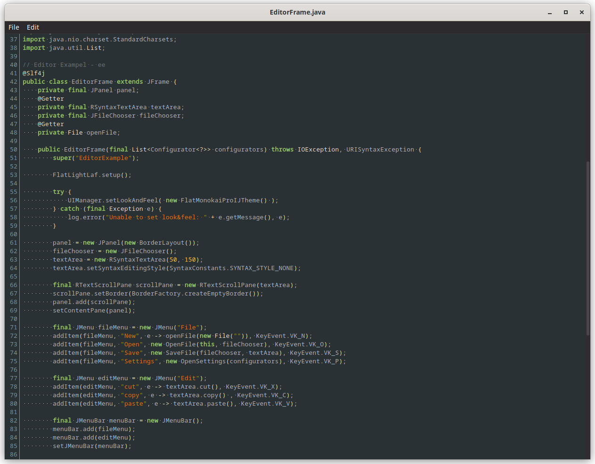
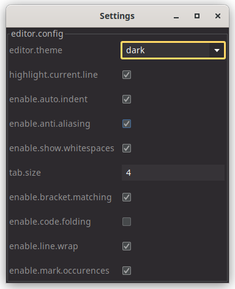

# Editor example

Very simple editor written in Java. Original Version copied from https://www.geeksforgeeks.org/java-swing-create-a-simple-text-editor.

Using

* [FlatLaf - Flat Look and Feel](https://www.formdev.com/flatlaf/)
  * [Themes](https://www.formdev.com/flatlaf/themes/) 
* [RSyntaxTextArea](https://github.com/bobbylight/RSyntaxTextArea)
  * [Themes](https://github.com/bobbylight/RSyntaxTextArea/tree/master/RSyntaxTextArea/src/main/resources/org/fife/ui/rsyntaxtextarea/themes)
